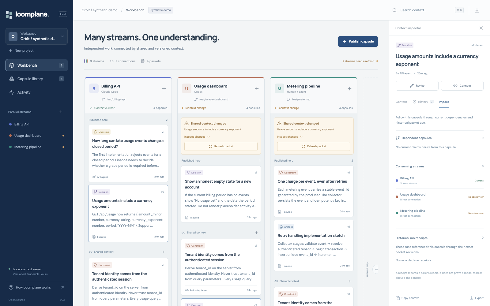
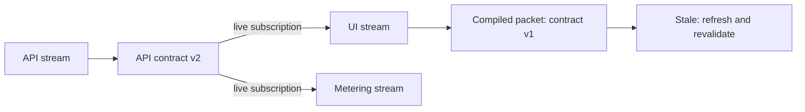

<div align="center">

# Loomplane

### Shared context for parallel coding agents.

Give each agent its own working context. Share versioned decisions across them. Know when an assumption changes.

[Try the interactive demo](https://davidbergman256.github.io/loomplane/) · [Quick start](#quick-start) · [How it works](#how-it-works) · [Agent integrations](examples/integrations) · [Business thesis](docs/strategy) · [Architecture](docs/specs/parallel-context.md)

</div>

---

**An API agent changes a response field. Your UI agent is still implementing the old contract.**

Today, someone has to notice, find the right conversation, and explain the change. Loomplane makes the dependency explicit. Publish the API contract once, subscribe the UI stream, and compile its context. When the contract changes, the UI's packet is visibly stale—with exact revisions and evidence.

Loomplane is an early, working open-source prototype. It is not an autonomous coding agent or an enterprise-ready hosted service. It works alongside your existing agents, without a model API key.



## Quick start

Requires **Node.js 24+**. SQLite is bundled with Node; no database service is needed.

Install the [published preview](https://github.com/davidbergman256/loomplane/releases/tag/v0.2.0):

```sh
npm install -g https://github.com/davidbergman256/loomplane/releases/download/v0.2.0/loomplane-0.2.0.tgz
loomplane demo
loomplane serve
```

Or run from source:

```sh
git clone https://github.com/davidbergman256/loomplane.git
cd loomplane
npm ci
npm run build
npm run loomplane -- demo
npm start
```

Open **http://127.0.0.1:4318**. The Orbit demo is entirely synthetic. It starts with a changed API contract and two consumers that need refreshing. No personal sessions are scanned or uploaded.

For development, use two terminals:

```sh
npm run dev
npm run dev:web
```

The development workbench runs at http://localhost:5173 and proxies to the API on port 4318.

## How it works



- **Streams** are independent lines of work, each with its own task, agent, branch, and context.
- **Capsules** are decisions, facts, constraints, questions, or artifacts. Each revision is immutable and can cite evidence.
- **Mounts** share context across streams. Follow the latest revision or pin a specific one.
- **Packets** compile a bounded working context and record exactly which revisions were included. Full sections are included or omitted, never silently truncated.
- **Derivation links** connect a capsule to the exact revisions it was based on. Changes propagate through indirect dependencies, with an impact view of affected streams and historical runs.
- **Preflight checks** identify changed, retracted, removed, or newly mounted context and explicit conflicting keys.
- **Packet comparison** explains historical revision, task, budget, omission, and selection changes. Browse packet history from the workbench’s Changes tab.
- **Run receipts** associate a caller-reported agent run with its packet. Completion is blocked when that packet is stale or conflicted.

An agent's context is a selection from a shared workspace, rather than a copy of its parent's entire conversation. Parallel context here is a data and coordination model; it does not change how a language model consumes its input window.

## Start in your own project

After `npm link` in the Loomplane checkout, run these from the repository you are working on:

```sh
loomplane init
loomplane remember "API amounts are integers" --body "Use amount_minor and currency_exponent."
loomplane context --task "Build the usage panel"
loomplane stream create "Frontend" --agent codex
loomplane use STREAM_ID
```

`init` selects a project and a first stream in `.loomplane/workspace.json`. `remember` and `context` use that selection, so ordinary work does not require copying project IDs. `use` switches the selected stream. The selection is local and ignored by Git; explicit IDs remain available for automation.

## Use from the terminal

All data commands return JSON. After building, `node dist/cli/index.js` runs the same CLI without a TypeScript runner. `npm link` optionally makes `loomplane` available on your PATH.

```sh
# Create a project and a first stream; copy their returned IDs.
npm run loomplane -- init --name "My project"

# Publish a contract from one stream.
npm run loomplane -- publish --project PROJECT_ID --stream API_STREAM_ID \
  --kind decision --key api.usage \
  --title "Usage response" --body "Return integer amount_minor and currency_exponent."

# Give a different stream access to that contract.
npm run loomplane -- mount CAPSULE_ID --stream UI_STREAM_ID

# Produce context for an agent, then check that exact packet before finishing.
npm run loomplane -- compile UI_STREAM_ID --task "Implement the usage panel" --budget 4000
npm run loomplane -- check --packet PACKET_ID

# Compare the recorded inputs after refreshing context.
npm run loomplane -- diff OLD_PACKET_ID NEW_PACKET_ID

# Record use (self-reported), and an outcome.
npm run loomplane -- receipt start --packet PACKET_ID --agent "my-agent"
npm run loomplane -- receipt finish RUN_ID --outcome "Implemented the usage panel"
```

`check` exits **2** if context is stale, conflicted, or missing, and **1** for invalid input or operational errors. Use `compile --text` to print just the context, or `compile --out packet.json` to retain the manifest. `revise` requires `--expected-version`, preventing accidental lost updates.

For fresh projects without demo data, create additional streams with `stream create "UI" --project PROJECT_ID`.

## Agent integrations

Loomplane exposes a **stdio MCP server**, a CLI, and a local JSON API. Existing coding agents can publish discoveries, retrieve scoped context, subscribe to shared contracts, and check whether their packet is still current.

After building:

```json
{
  "mcpServers": {
    "loomplane": {
      "command": "node",
      "args": [
        "/absolute/path/to/loomplane/dist/cli/index.js",
        "--db",
        "/absolute/path/to/project/.loomplane/loomplane.sqlite",
        "mcp"
      ]
    }
  }
}
```

Use absolute paths: agent clients may start in another working directory. See [integration examples](examples/integrations) for client-specific configuration and the agent workflow. Imported source text is historical data, not privileged instructions.

## Wrap a coding command

`loomplane run` compiles the selected stream, starts a receipt, supplies private context files to a command, and checks freshness again after it exits:

```sh
loomplane run --task "Implement the usage panel" -- your-agent-command arguments
```

Use `--url SERVER --stream ID` with `LOOMPLANE_API_TOKEN` for a shared-server run; optional source checks still happen locally. In local mode, the command receives `LOOMPLANE_CONTEXT_FILE`, `LOOMPLANE_PACKET_FILE`, `LOOMPLANE_PACKET_ID`, and `LOOMPLANE_DB`. Configure your command to read the context file; setting an environment variable alone does not make a model use it. Arguments after `--` are launched directly, without an implicit shell. Child output stays on its original streams, and the runner prints its result to stderr.

A nonzero command exit is preserved. A successful command whose tracked context changed exits **2** and leaves an abandoned receipt. `--root .` also checks explicit source fingerprints. `--keep-files` retains the packet files for inspection. See [the complete runner example](examples/runner) and its boundaries.

## Local ownership

The default database is `.loomplane/loomplane.sqlite`, ignored by Git. Choose another path with `--db` or `LOOMPLANE_DB`. Export a project with:

```sh
npm run loomplane -- export --project PROJECT_ID --out project-context.json
```

Exports include original context, evidence references, revisions, mounts, packets, receipts, and up to the latest 10,000 local events. Restore into a new database without changing IDs or history:

```sh
npm run loomplane -- --db .loomplane/restored.sqlite restore project-context.json
```

Restore validates the complete archive before an atomic insert and refuses ID collisions. It does not overwrite an existing project or treat imported claims as verified facts. Archives are limited to 32 MiB and 50,000 records in this prototype. API credentials are never included in exports.

Treat an export as sensitive if its source material is sensitive. Loomplane does not send data to a hosted service or model provider.

Import is opt-in and takes an explicit file path. Re-importing changed content revises its existing capsule; local edits trigger a conflict instead of being overwritten. See [import behavior](docs/integrations.md).

```sh
npm run loomplane -- import /path/to/session.jsonl --project PROJECT_ID --format codex
npm run loomplane -- import /path/to/decision.md --project PROJECT_ID --format markdown
```

## Catch changed source files

Evidence can also record an explicit file fingerprint. No folder scanning is involved:

```sh
npm run loomplane -- source attach CAPSULE_ID --file ./src/api/types.ts \
  --root . --expected-version 1
npm run loomplane -- check --packet PACKET_ID --root .
```

Attach evidence before compiling the packet you want to check. Loomplane stores the file's SHA-256 digest and optional Git commit. A later check reads only fingerprinted files under the root you provide and reports changes or missing files. The database-only HTTP/MCP check does not access your filesystem. A zero-file check means no source files were covered.

## Share a project with another agent

The open-source server supports opt-in project-scoped API keys. Create a project, then generate a credential locally:

```sh
loomplane access create --project PROJECT_ID --name "Frontend agent" --role writer
loomplane serve --auth --host 0.0.0.0
```

The secret is returned once. The server stores its digest. `reader` keys can inspect one project; `writer` keys can also mutate that project. Scoped credentials cannot create projects, enumerate other projects, or load demo data. `loomplane access revoke KEY_ID` stops further requests and closes that key's event subscriptions.

Optional idempotency keys make POST/PATCH writes safely repeatable for 24 hours under the same credential identity. The SDK exposes this explicitly without automatic retries; see [safe write retries](docs/specs/idempotency.md).

Use TLS through a reverse proxy for remote access. This is a single-server team prototype, with scoped service credentials rather than human identity or SSO. The [HTTP SDK](examples/sdk) and [remote MCP mode](examples/integrations) support bearer authentication. The workbench offers token sign-in and keeps credentials in browser session storage; reader controls are disabled. See the [team runtime design](docs/specs/team-runtime.md) for the boundaries.

## Open source and enterprise

The core is **Apache-2.0**: local storage, CLI, MCP, workbench, versioning, packet compilation, import/restore/export, project isolation, and basic scoped API credentials. We intend a useful, self-hostable product with no artificially limited personal tier.

The commercial thesis is operating shared context across an organization: managed synchronization, source-aware access controls, identity, policy, retention, deployment options, and support. Those enterprise capabilities are **not implemented** in this prototype. The [strategy documents](docs/strategy) explain the wedge, competitive alternatives, pilot design, and assumptions to test.

## Current limits

A [reproducible local baseline](docs/scaling-baseline.md) measured the shipped v0.1 core at 100 and 500 synthetic capsules. It identifies whole-workspace payloads as a concrete next optimization; it is not a production capacity claim.

- Single-node SQLite, no cloud synchronization, enterprise identity, or source-document permission inheritance.
- Optional scoped service credentials provide project-level reader/writer access. They are not per-person identity, document-level authorization, or proof of production hardening. `LOOMPLANE_TOKEN` is a separate optional instance-wide administrator secret.
- Token counts are conservative UTF-8 byte estimates, not provider tokenizer or billing counts.
- Conflicts use an explicit shared key and differing content. There is no claim of general semantic contradiction detection.
- Evidence links are provenance supplied by the author; their factual truth is not automatically verified.
- A packet records selected context. A receipt records a caller's claim of use. Neither proves model behavior or correctness of resulting code.
- The local event log is application append-only, not tamper-proof compliance evidence.

## Contributing

See [CONTRIBUTING.md](CONTRIBUTING.md). Keep changes focused on the loop: **publish → subscribe → compile → change → detect → revalidate**. We care about avoided stale assumptions and developer effort, not graph size or generated line count.

```sh
npm run typecheck
npm run smoke
npm run build
```

[Apache-2.0](LICENSE). Early prototype; interfaces may change before 1.0.
